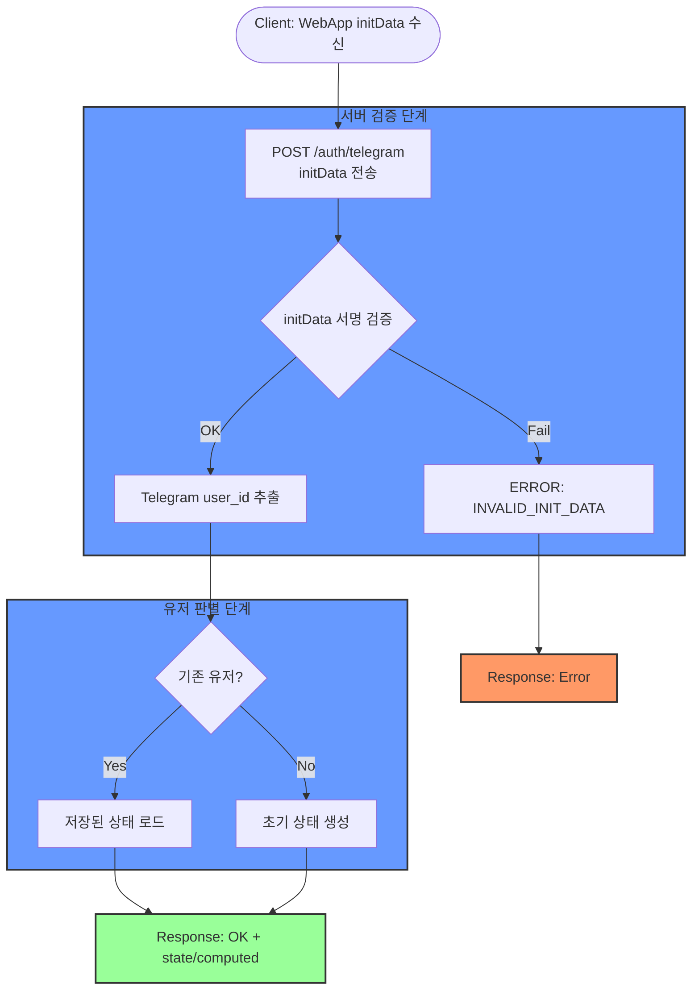
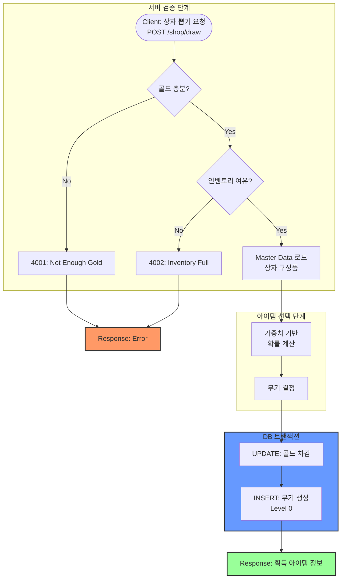
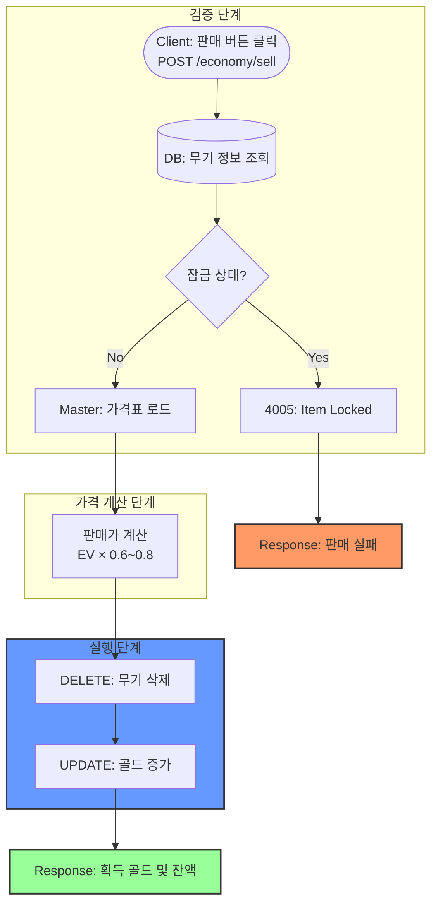

# Tap Smith 플로우 차트 (v1.4)

## 목차
1. [초기 접속 & 인증 (Auth + State)](#1-초기-접속--인증-auth--state)
2. [상자 뽑기 (Gacha System)](#2-상자-뽑기-gacha-system)
3. [강화 시도 (Enchantment Loop)](#3-강화-시도-enchantment-loop)
4. [무기 판매 (Selling / Exit Strategy)](#4-무기-판매-selling--exit-strategy)
5. [로직 설명 및 주의사항](#5-로직-설명-및-주의사항)

---

## 1. 초기 접속 & 인증 (Auth + State)

**유저가 웹앱에 최초 접속했을 때 인증/검증 후 신규/기존을 판별합니다.**



**플로우 설명:**
1. **검증 단계**: Telegram `initData` 서명 검증(HMAC) 실패 시 요청 거절
2. **판별 단계**: 기존 유저면 저장된 상태 반환, 신규 유저면 초기 상태 생성
3. **응답**: `state` + `computed` 포함 응답

---

## 2. 상자 뽑기 (Gacha System)

**유저가 골드를 소모하여 랜덤한 무기를 획득하는 과정입니다.**



**플로우 설명:**
1. **검증 단계**: 골드와 인벤토리 공간 확인
2. **선택 단계**: 마스터 데이터 기반 확률 계산
3. **트랜잭션**: 골드 차감과 무기 생성을 원자적으로 처리

---

## 3. 강화 시도 (Enchantment Loop)

**가장 중요한 로직입니다. 낙관적 락을 통해 '따닥' 버그를 방지하고, 파괴 시 복구 불가능한 처리를 수행합니다.**

```mermaid
flowchart TD
    %% 시작
    Start([Client: 강화 버튼 클릭<br/>POST /enchantment/enchant])

    %% 서버 검증
    subgraph Validation [서버 검증 단계]
        Start --> LoadData[(DB: 유저/무기 정보 조회)]
        LoadData --> CheckValid{유효성 검증<br/>무기존재/잠금/골드}
        CheckValid -->|실패| Error[Error Return<br/>4001/4003/4005]
        CheckValid -->|통과| LoadBalance[Master: 확률표 로드]
    end

    %% 확률 계산 및 판정
    subgraph Calculation [결과 판정 단계]
        LoadBalance --> CalcProb[확률 계산<br/>0~10000 범위]
        CalcProb --> ResultBranch{결과 판정}
    end

    %% 트랜잭션 처리
    subgraph Transaction [트랜잭션 (Atomic)]
        ResultBranch -->|SUCCESS| SuccessLogic[Level +1<br/>Gold 차감<br/>Version +1]
        ResultBranch -->|FAIL| FailLogic[Level 유지<br/>Gold 차감<br/>Version +1]
        ResultBranch -->|BREAK| BreakLogic[무기 DELETE<br/>Dust 지급<br/>Gold 차감<br/>Version +1]

        SuccessLogic --> UpdateDB[(DB Update)]
        FailLogic --> UpdateDB
        BreakLogic --> UpdateDB

        UpdateDB --> VersionCheck{Version 일치?}
        VersionCheck -->|No| Rollback[Rollback<br/>따닥 감지]
        VersionCheck -->|Yes| LogHistory[로그 기록<br/>log_enchant_history]
    end

    %% 응답
    LogHistory --> Response([Response: 결과 및 연출 데이터])
    Error --> ErrorResponse([Response: Error])
    Rollback --> ErrorResponse

    %% 스타일링
    classDef success fill:#9f9,stroke:#333,stroke-width:2px
    classDef error fill:#f96,stroke:#333,stroke-width:2px
    classDef break fill:#f66,stroke:#333,stroke-width:2px
    classDef process fill:#69f,stroke:#333,stroke-width:2px

    class SuccessLogic success
    class FailLogic process
    class BreakLogic break
    class ErrorResponse error
    class Transaction process
```

**플로우 설명:**
1. **검증 단계**: 무기 존재, 잠금 상태, 골드 잔액 확인
2. **판정 단계**: 서버에서 난수 생성 및 결과 결정
3. **트랜잭션**: 모든 변경사항을 원자적으로 처리 (따닥 방지)

---

## 4. 무기 판매 (Selling / Exit Strategy)

**유저가 강화를 멈추고 이익을 실현(익절)하는 과정입니다.**



**플로우 설명:**
1. **검증 단계**: 잠금 상태 확인
2. **계산 단계**: 마스터 데이터 기반 판매 가격 산정
3. **실행 단계**: 무기 삭제와 골드 지급을 원자적으로 처리

---

## 5. 로직 설명 및 주의사항

### A. 동시성 제어 (Concurrency Control)
**위치**: 강화 시도 Flow의 Transaction 단계

**원리**:
```sql
UPDATE users
SET gold = gold - ?, version = version + 1
WHERE user_id = ? AND version = ?
```

**효과**: 유저가 버튼을 빠르게 두 번 눌러도 첫 번째 요청이 version을 변경시키므로 두 번째 요청은 실패합니다.

### B. 데이터 정합성 (Data Integrity)
**강화 파괴 시**: 반드시 무기 삭제와 가루 지급을 하나의 트랜잭션으로 묶어야 합니다.

**목적**: 무기는 사라졌는데 보상이 안 들어오거나, 반대로 무기가 남아있는 버그 방지

### C. 서버 권한 (Server Authority)
**모든 확률 계산과 가격 산정은 클라이언트 데이터가 아닌 DB Master Data를 기준으로 서버 내부에서 수행됩니다.**

**보안**: 클라이언트는 weapon_uid만 전송, 서버가 모든 로직 처리

### D. 에러 처리 전략
- **4001-4005**: 클라이언트 에러 (재시도 가능/불가능 명시)
- **5000**: 서버 에러 (트랜잭션 실패 등)
- **Rate Limit**: `/enchantment/enchant`는 초당 1회 제한

### E. 로그 추적
모든 강화 시도는 `log_enchant_history`에 기록되어 CS 대응 및 통계 분석에 사용됩니다.

---

## Mermaid 스타일 가이드

### 노드 타입
- `[]`: 시작/종료 노드
- `{}`: 조건 분기
- `()`: 데이터베이스 작업
- `[]`: 일반 처리

### 색상 코드
- 🟢 **Success**: `#9f9` (녹색)
- 🔴 **Error**: `#f96` (주황)
- 🔴 **Break**: `#f66` (빨강)
- 🔵 **Process**: `#69f` (파랑)

### 플로우 방향
- `TD`: Top-Down (위에서 아래로)
- `LR`: Left-Right (왼쪽에서 오른쪽으로)

---

## 업데이트 히스토리

| 버전 | 날짜 | 변경사항 |
|------|------|---------|
| v1.4 | 2026-02-01 | Mermaid 스타일링 개선, 설명 추가, 구조 정리 |
| v1.3 | 2026-01-20 | 낙관적 락 로직 추가 |
| v1.0 | 2025-12-01 | 초기 플로우 차트 작성 |